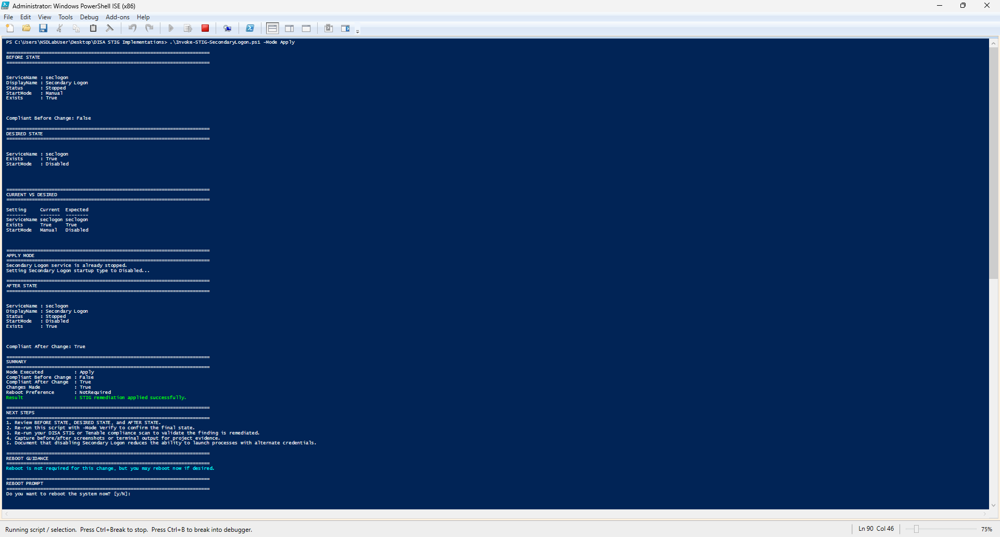
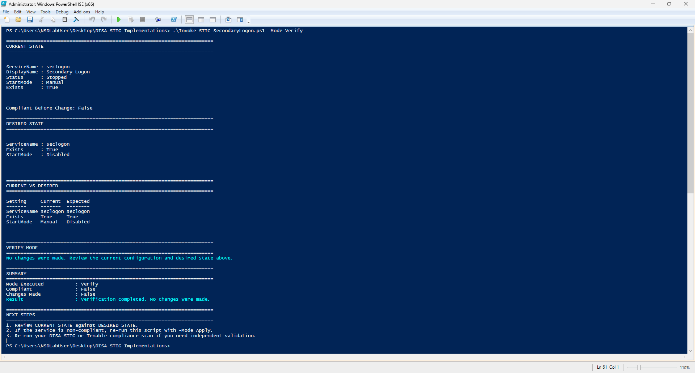

<h1 align="center">Windows 11 STIG Remediation Lab</h1>

<p align="center">
  DISA STIG implementation, PowerShell automation, and Tenable-based validation on Windows 11
</p>

<p align="center">
  
  
  
  
  
  
</p>

<p align="center">
  <picture>
    <source media="(prefers-color-scheme: dark)" srcset="images/windows11-stig-banner-dark.png">
    <source media="(prefers-color-scheme: light)" srcset="images/windows11-stig-banner-light.png">
    
  </picture>
</p>

---

## Table of Contents

- [Overview](#overview)
- [Objectives](#objectives)
- [Project Scope](#project-scope)
- [Primary Remediation Groups](#primary-remediation-groups)
- [STIG Coverage Summary](#stig-coverage-summary)
- [Tools Used](#tools-used)
- [Repository Structure](#repository-structure)
- [Scan Progression](#scan-progression)
- [Notable Findings and Lessons Learned](#notable-findings-and-lessons-learned)
- [Known Issue](#known-issue)
- [Evidence](#evidence)
- [Scripts](#scripts)
- [Related Projects](#related-projects)
- [License](#license)

---

## Overview

This repository documents a **Windows 11 DISA STIG remediation lab** built around iterative hardening, validation, and evidence collection.

The project focused on identifying failed Windows 11 STIG findings in **Tenable Vulnerability Management**, remediating them with **PowerShell automation**, and validating progress through repeated scan cycles. It also captures real-world remediation behavior such as:

- **FAILED → WARNING → PASSED** progression
- policy-backed vs. registry-only enforcement differences
- indirect STIG status changes caused by related configuration updates
- operational side effects introduced by certain hardening actions

This was approached as a practical **security engineering / blue team** project rather than a checklist exercise.

---

## Objectives

- remediate selected **Windows 11 DISA STIG** findings
- automate enforcement with **PowerShell**
- validate remediation using **Tenable** scans
- document the remediation lifecycle across multiple scan iterations
- preserve evidence suitable for a public **GitHub portfolio project**

---

## Project Scope

The project was originally framed around **10 remediation groups**, but the work ultimately influenced **roughly 12 STIGs or more** because some controls changed status indirectly after related remediations, policy refreshes, or scanner re-evaluation.

This repository focuses on the remediation groups that were actively worked on and documented:

- **Secondary Logon Service**
- **Lock Screen Hardening**
- **Windows Firewall**
- **SMBv1 Hardening**
- **Account Lockout Policy**
- **Password Policy**

Some later groups from the broader roadmap were intentionally not completed here because the project requirement had already been met and exceeded.

---

## Primary Remediation Groups

### 1) Secondary Logon Service
- **WN11-00-000175** — Secondary Logon service must be disabled

### 2) Lock Screen Hardening
- **WN11-CC-000005** — Camera access from the lock screen must be disabled
- **WN11-CC-000010** — Lock screen slide shows must be disabled

### 3) Windows Firewall
- **WN11-00-000135** — Host-based firewall must be installed and enabled

### 4) SMBv1 Hardening
- **WN11-00-000160** — SMBv1 must be disabled on the system
- **WN11-00-000165** — SMBv1 must be disabled on the SMB server
- **WN11-00-000170** — SMBv1 must be disabled on the SMB client

### 5) Account Lockout Policy
- **WN11-AC-000005** — Account lockout duration
- **WN11-AC-000010** — Bad logon attempts threshold
- **WN11-AC-000015** — Reset account lockout counter after

### 6) Password Policy
- **WN11-AC-000020** — Password history
- **WN11-AC-000030** — Minimum password age
- **WN11-AC-000035** — Minimum password length
- **WN11-AC-000040** — Password complexity

---

## STIG Coverage Summary

| Category | STIG IDs | Notes |
|---|---|---|
| Secondary Logon | WN11-00-000175 | Service hardening |
| Lock Screen | WN11-CC-000005, WN11-CC-000010 | Included a FAILED → WARNING → PASSED progression |
| Windows Firewall | WN11-00-000135 | Technically remediated, but introduced authenticated scan side effects |
| SMBv1 Hardening | WN11-00-000160, WN11-00-000165, WN11-00-000170 | Some status changes occurred indirectly |
| Account Lockout | WN11-AC-000005, WN11-AC-000010, WN11-AC-000015 | Grouped policy remediation |
| Password Policy | WN11-AC-000020, WN11-AC-000030, WN11-AC-000035, WN11-AC-000040 | Grouped policy remediation |

---

## Tools Used

- **Windows 11**
- **Tenable Vulnerability Management**
- **PowerShell 5.1**
- **DISA Windows 11 STIG**
- **Local Security Policy / Group Policy-backed registry paths**
- **GitHub** for documentation and portfolio presentation

---

## Repository Structure

```text
windows-11-stig-remediation/
│
├── README.md
├── images/
│   ├── windows11-stig-banner-light.png
│   ├── windows11-stig-banner-dark.png
│
├── scans/
│   ├── scan-1-baseline.pdf
│   ├── scan-2-secondary-logon.pdf
│   ├── scan-3-lock-screen-v1.pdf
│   ├── scan-4-lock-screen-v2.pdf
│   ├── scan-5-account-lockout.pdf
│   └── scan-6-password-policy.pdf
│
├── scripts/
│   ├── Invoke-STIG-SecondaryLogon.ps1
│   ├── Invoke-STIG-LockScreenHardening.ps1
│   ├── Invoke-STIG-WindowsFirewall.ps1
│   ├── Invoke-STIG-SMBv1Hardening.ps1
│   ├── Invoke-STIG-AccountLockout.ps1
│   └── Invoke-STIG-PasswordPolicy.ps1
│
├── evidence/
│   ├── secondary-logon/
│   ├── lock-screen/
│   ├── firewall/
│   ├── smbv1/
│   ├── account-lockout/
│   └── password-policy/
│
└── reports/
    ├── remediation-summary.md
    └── final-report.md
```

---

## Scan Progression

| Scan | Focus | High-Level Outcome |
|---|---|---|
| Scan 1 | Baseline | Initial failed findings identified |
| Scan 2 | Secondary Logon | Secondary Logon remediated; some SMB-related changes also observed |
| Scan 3 | Lock Screen v1 | One lock screen setting passed; another improved to warning |
| Scan 4 | Lock Screen v2 | Lock screen slideshow setting reached passed state |
| Scan 5 | Account Lockout | Account lockout policy findings remediated |
| Scan 6 | Password Policy | Password policy findings remediated |

---

## Notable Findings and Lessons Learned

### 1) Policy-backed enforcement matters
Some administrative-template settings were not fully satisfied by simply setting a value unless the value was enforced under the expected **policy-backed registry path**.

### 2) Improved does not always mean compliant
One lock screen setting moved from **FAILED** to **WARNING** before reaching **PASSED**, showing that scanners can distinguish between:
- partial configuration
- correct value placement
- fully compliant policy enforcement

### 3) Security controls can affect tooling
The Windows Firewall remediation highlighted an important operational reality: a control can be technically correct yet still interfere with authenticated scanning behavior.

### 4) Some STIGs changed indirectly
A few findings changed status even when they were not directly targeted, likely due to:
- reboot effects
- policy refreshes
- related control interactions
- scanner re-evaluation behavior

This is part of what made the project valuable as a real-world hardening exercise.

---

## Known Issue

### Windows Firewall STIG
After enabling Windows Firewall for the related STIG:

- the scan still completed successfully
- however, the **Audits / Compliance** tab disappeared in Tenable
- scan duration dropped significantly

This suggests authenticated compliance checks were likely impacted by firewall-related management traffic restrictions. The remediation itself was technically valid, but additional tuning would be needed to preserve authenticated scanning behavior in the lab.

This issue was intentionally documented and deferred rather than hidden.

---

## Evidence

Recommended evidence categories for this repository:

### Secondary Logon
- Apply output
- Verify output
- before/after service state

### Lock Screen Hardening
- `WN11-CC-000010` failed screenshot
- `WN11-CC-000010` warning screenshot
- `WN11-CC-000010` passed screenshot

### Account Lockout Policy
- relevant Tenable audit detail screenshots
- script Apply / Verify output

### Password Policy
- relevant Tenable audit detail screenshots
- script Apply / Verify output

You can place those under the `evidence/` folders and reference them here with standard Markdown image links once uploaded.

Example:




---

## Scripts

All remediation scripts follow a reusable structure based on:

- `-Mode Verify|Apply|Rollback`
- before/after state capture
- mode-aware summaries
- next steps guidance
- optional reboot prompting where appropriate

This made the scripts easier to test, document, and reuse across multiple STIG remediation categories.

Current script set:

- `Invoke-STIG-SecondaryLogon.ps1`
- `Invoke-STIG-LockScreenHardening.ps1`
- `Invoke-STIG-WindowsFirewall.ps1`
- `Invoke-STIG-SMBv1Hardening.ps1`
- `Invoke-STIG-AccountLockout.ps1`
- `Invoke-STIG-PasswordPolicy.ps1`

---

## Related Projects

- [Vulnerability Management Program Implementation](https://github.com/SDimitri05/vulnerability-management-program)
- [Programmatic Vulnerability Remediation](https://github.com/SDimitri05/programmatic-vulnerability-remediation)

---

## License

This project is licensed under the **MIT License**.
